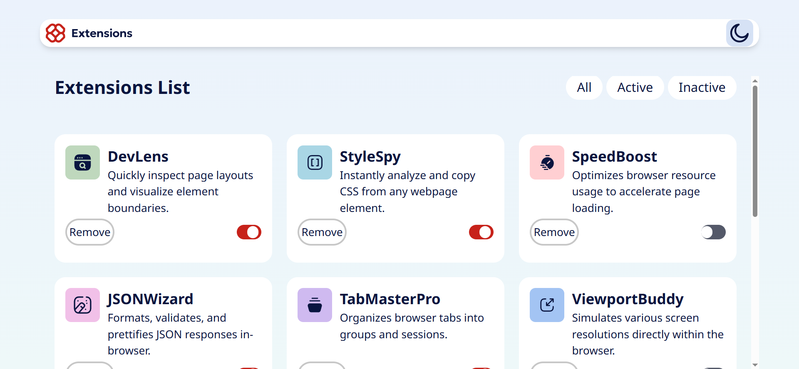

# Frontend Mentor - Browser extensions manager UI solution

This is a solution to the [Browser extensions manager UI challenge on Frontend Mentor](https://www.frontendmentor.io/challenges/browser-extension-manager-ui-yNZnOfsMAp). Frontend Mentor challenges help you improve your coding skills by building realistic projects. 

## Table of contents

- [Overview](#overview)
  - [The challenge](#the-challenge)
  - [Screenshot](#screenshot)
  - [Links](#links)
- [My process](#my-process)
  - [Built with](#built-with)
  - [What I learned](#what-i-learned)
  - [Useful resources](#useful-resources)
- [Author](#author)


## Overview

### The challenge

Users should be able to:

- Toggle extensions between active and inactive states
- Filter active and inactive extensions
- Remove extensions from the list
- Select their color theme
- View the optimal layout for the interface depending on their device's screen size
- See hover and focus states for all interactive elements on the page

### Screenshot



### Links

- Live Site URL: [Live solution on vercel](https://challenge-front-end-journey-hfyl.vercel.app/)

## My process

### Built with

- Semantic HTML5 markup
- Tailwindcss Utilities 
- Javascript 
- Mobile-first workflow

### What I learned

Learnt to set Dark Mode with Tailwind by using darkMod in Tailwind.config.js file :

```JS extract 
/** @type {import('tailwindcss').Config} */
module.exports = {
  darkMode: 'class',}
```

## Author

- Frontend Mentor - [@gabriengoh](https://www.frontendmentor.io/profile/gabrielngoh)
- GitHub - [@gabriengoh](https://github.com/gabrielngoh)
- linkedIn - [@gabriel-pierre-ngoh-dooh](https://www.linkedin.com/in/gabriel-pierre-ngoh-dooh-03aab6309/)

